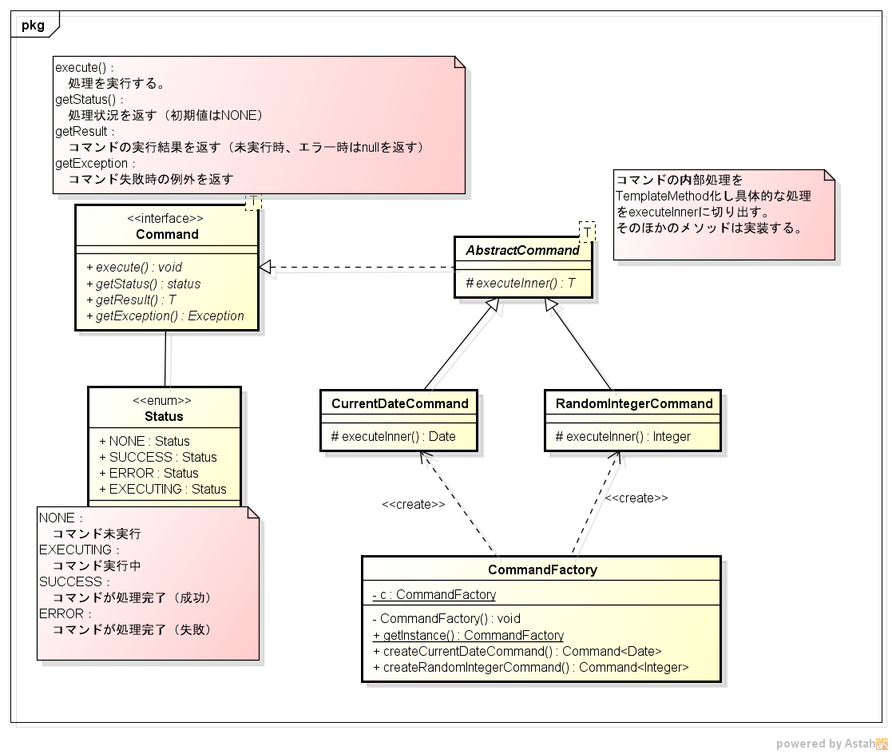

[目次](../toc.md)
[前の問題](../072/README.md)　[次の問題](../074/README.md)

***
## 073：複合(13)
* リーダーから、以下のクラス図が渡された。クラス図の設計意図を読み取り、実装せよ。
    * `CurrentDateCommand`は、「現在日時を表すDate」、`RandomIntegerCommand`は、ランダムな数値を返すコマンドとして実装せよ。

